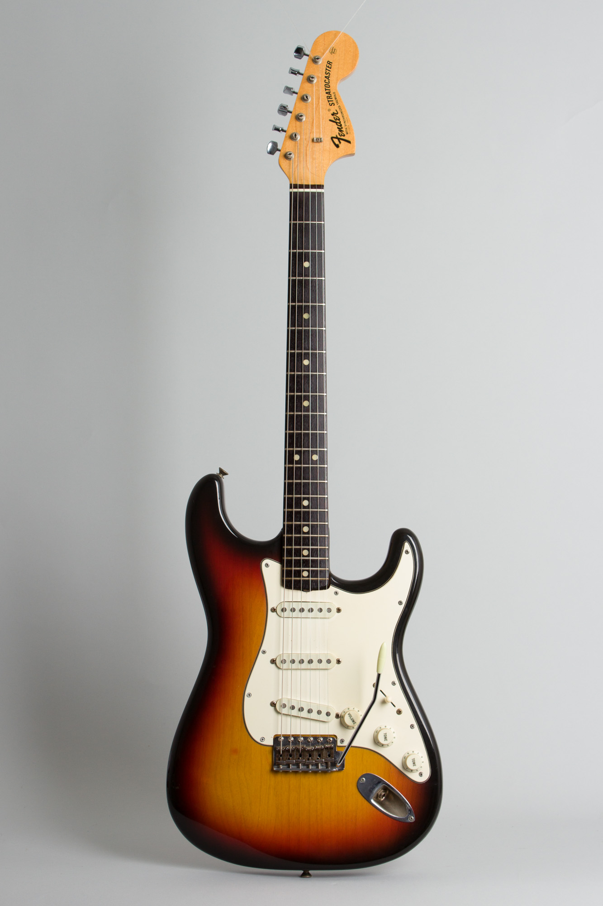
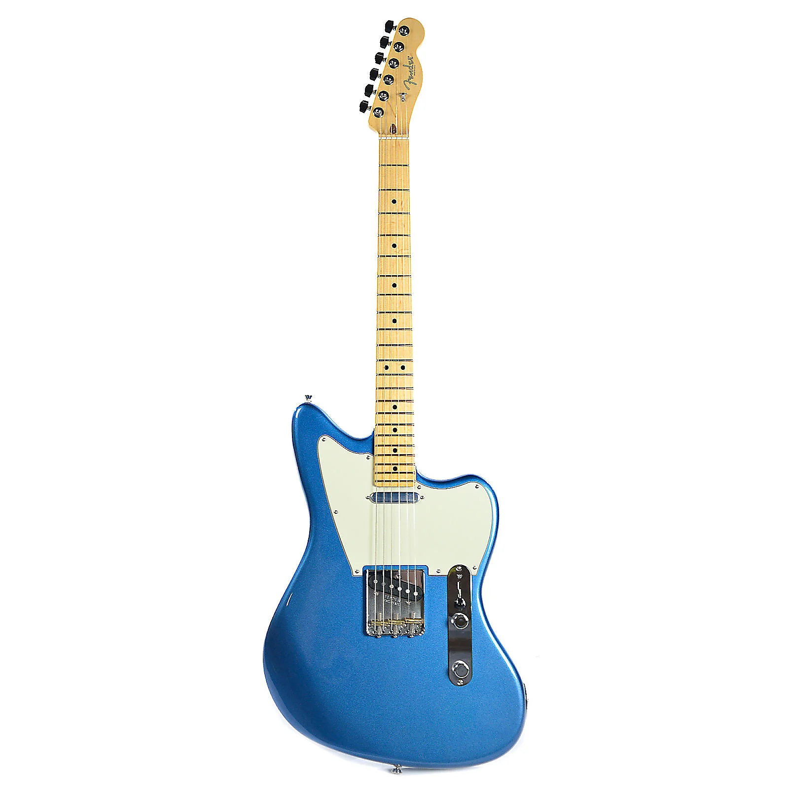
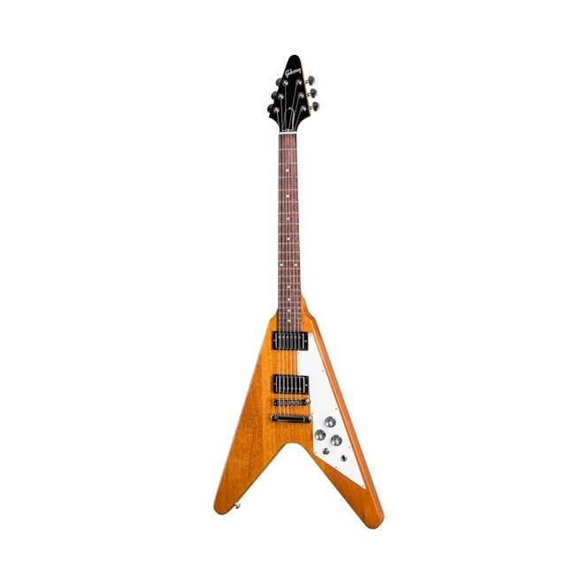
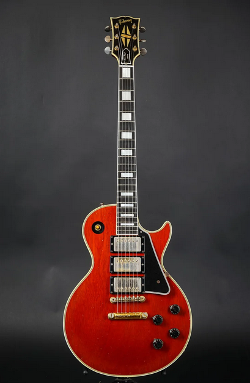

# Classificador de imagens de guitarra

### Script em Python de classificação de modelos de guitarra em 4 tipos mais comuns de modelos

Feito Usando TensorFlow. Este projeto é didático para aprendizado do uso da biblioteca TensorFlow em visão computacional.

### Os modelos utilzados nos datasets são: 

- Stratocaster

- Telecaster

- Flying V

- Les Paul

